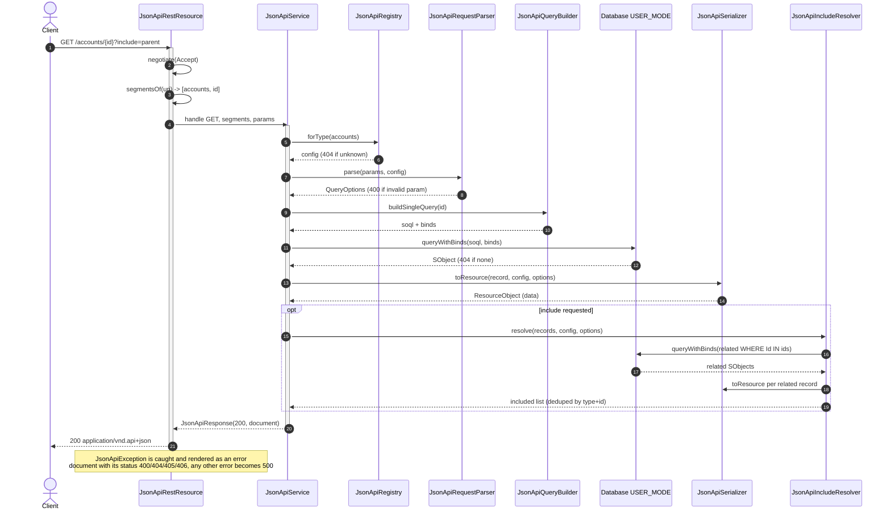

# Apex JSON:API Framework — Technical Design

This document describes the internal design of the framework: how a request flows
through the layers, what each class is responsible for, how SOQL is generated
safely, the security model, key algorithms, and the extension points. It is aimed
at developers maintaining or extending the framework. For usage/endpoint
reference, see [`JSON-API-README.md`](../force-app/main/default/classes/JSON-API-README.md).

- **Spec target:** [JSON:API v1.1](https://jsonapi.org/format/)
- **Platform:** Apex (API 65.0), no namespace, no external dependencies
- **Source:** `force-app/main/default/classes/`

---

## 1. Design goals & principles

| Goal | How it's realized |
|------|-------------------|
| **Configuration over code** | New resources are exposed by subclassing `JsonApiResourceConfig` + one `JsonApiResource__mdt` Custom Metadata record — no change to the framework, no new endpoints, parsing, or SOQL. |
| **Single responsibility per class** | HTTP, routing, parsing, query building, serialization, and persistence are separate, independently testable units. |
| **Secure by default** | All SOQL runs in `AccessLevel.USER_MODE`; identifiers come only from config; values are always bind variables. Read-only — no DML. |
| **Spec compliance** | Document model mirrors the JSON:API object model; content negotiation and error documents follow the spec. |
| **Transport independence** | The service layer returns a `JsonApiResponse` value object; only `JsonApiRestResource` touches `RestContext`. This keeps the core unit-testable without HTTP. |

---

## 2. Layered architecture

```
                       HTTP (application/vnd.api+json)
                                  │
                  ┌───────────────▼────────────────┐
                  │      JsonApiRestResource         │  HTTP concerns only:
                  │  @RestResource('/jsonapi/*')     │  verb routing, content
                  └───────────────┬────────────────┘  negotiation, response I/O
                                  │ method, segments[], params, body
                  ┌───────────────▼────────────────┐
                  │         JsonApiService           │  routing table + orchestration
                  └──┬───────┬───────┬───────┬──────┘
                     │           │            │
        ┌────────────▼─┐ ┌───────▼──┐ ┌───────▼───────────┐
        │ RequestParser│ │  Query   │ │ Serializer        │
        │  →QueryOpts  │ │  Builder │ │ + IncludeResolver │
        └──────┬───────┘ └─────┬────┘ └───────┬───────────┘
               │               │              │
               │        ┌──────▼─────┐        │
               │        │  Database  │        │  queryWithBinds (USER_MODE)
               │        └────────────┘        │
        ┌──────▼─────────────────────────▼──────┐
        │  Registry ← Bootstrap ← ResourceConfig  │  config & metadata
        └─────────────────────────────────────────┘
                                  │
                  ┌───────────────▼────────────────┐
                  │  Document model (DTOs) → JSON    │
                  └─────────────────────────────────┘
```

### Class responsibilities

| Layer | Class | Responsibility |
|-------|-------|----------------|
| HTTP | `JsonApiRestResource` | The only `@RestResource`. Routes verbs, enforces content negotiation, splits the URI, writes the response, renders exceptions as error documents. |
| Orchestration | `JsonApiService` | Routing table (verb + path shape → operation). Runs queries/DML. Builds the response document including `meta` and pagination `links`. |
| Orchestration | `JsonApiResponse` | Transport-agnostic `{statusCode, document, headers}` value object. |
| Config | `JsonApiResourceConfig` | Abstract base mapping a JSON:API `type` → SObject, attribute groups and relationships. |
| Config | `JsonApiRelationshipDef` | Declares a to-one (lookup field) or to-many (child FK) relationship. |
| Config | `JsonApiRegistry` | Lookups by type and by SObjectType; lazy self-initialization. |
| Config | `JsonApiBootstrap` | Loads active `JsonApiResource__mdt` records and instantiates each named Apex config via reflection. |
| Parsing | `JsonApiRequestParser` | Raw params → validated `JsonApiQueryOptions`. |
| Parsing | `JsonApiQueryOptions` | Typed `include` / `fields` / `sort` / `filter` / `page` (+ inner `SortField`). |
| Data | `JsonApiQueryBuilder` | Generates parameterized SOQL (collection / single / count) + a `binds` map. |
| Data | `JsonApiIncludeResolver` | Coalesces `include` paths into a tree and bulk-queries related records for the `included` array. |
| Data | `JsonApiQueryGateway` / `JsonApiUserModeGateway` | The DB seam: interface over query execution; the production impl runs everything in `USER_MODE`. Swappable for an in-memory test double. |
| Serialization | `JsonApiSerializer` | SObject → `JsonApiResourceObject` (attributes, to-one linkage, links). |
| Model | `JsonApiDocument`, `JsonApiResourceObject`, `JsonApiResourceIdentifier`, `JsonApiRelationship`, `JsonApiError`, `JsonApiErrorSource` | The JSON:API document object model. |
| Errors | `JsonApiException` | Carries HTTP status + `errors[]`; factory methods per status. |
| Observability | `JsonApiObservability` / `JsonApiObserver` / `JsonApiRequestLog` / `JsonApiDebugObserver` | Per-request telemetry emitted at the HTTP boundary to a pluggable observer (default: structured debug log). |
| Constants | `JsonApiConstants` | Media type, base path, param names, pagination limits. |

---

## 3. Request lifecycle (end to end)

Tracing `GET /services/apexrest/jsonapi/accounts/001.../?include=parent&fields[accounts]=name`:

1. **Entry** — `JsonApiRestResource.doGet()` (the only HTTP handler) runs the request directly.
2. **Content negotiation** — `negotiate()` validates `Accept`: a JSON:API media type that is parameterized in every instance → `406`.
3. **Path split** — `segmentsOf(requestURI)` finds the `jsonapi` base token and returns the URL-decoded segments after it: `['accounts', '001...']`.
4. **Service dispatch** — `JsonApiService.handle('GET', segments, params)`:
   - any non-GET verb → `405`;
   - `JsonApiRegistry.forType('accounts')` resolves the config (lazy-initializing the registry via `JsonApiBootstrap` on first call). Unknown type → `404`.
   - routes by path shape → `handleGet()`.
5. **Parse query** — `JsonApiRequestParser.parse(params, config)` produces `JsonApiQueryOptions`. Unknown sort/filter/include names are rejected with `400` here, before any SOQL exists.
6. **Build & run SOQL** — for a single record, `JsonApiQueryBuilder.buildSingleQuery(id)` produces `SELECT Id, Name, ParentId FROM Account WHERE Id = :recordId LIMIT 1` with `binds = {recordId}`. Executed via `Database.queryWithBinds(..., AccessLevel.USER_MODE)`.
7. **Serialize** — `JsonApiSerializer.toResource()` maps fields → attributes (honoring sparse `fields[accounts]=name`), emits to-one relationship linkage from the `ParentId` value, and adds a `self` link.
8. **Resolve includes** — `JsonApiIncludeResolver.resolve()` collects `ParentId` values, bulk-queries the parent Accounts, serializes them into `included` (deduplicated by `type:id`).
9. **Assemble** — `JsonApiDocument.ofData(resource)` (stamped with `jsonapi.version`), `included` attached.
10. **Write response** — `writeResponse()` sets the status code, `Content-Type: application/vnd.api+json`, any extra headers, and the serialized body.
11. **Errors** — any `JsonApiException` thrown anywhere in 2–10 is caught in `doGet()` and rendered as a JSON:API error document with the carried HTTP status; any other exception becomes a `500` error document.
12. **Telemetry** — in a `finally`, `doGet()` emits a `JsonApiRequestLog` (status, duration, SOQL count, rows, error code/reference) to the active `JsonApiObserver`.

### Sequence diagram

A `GET /jsonapi/accounts/{id}?include=parent` request through the layers:



_(If your viewer doesn't render Mermaid, see the exported
[request-sequence.svg](img/request-sequence.svg) /
[request-sequence.png](img/request-sequence.png).)_

For a **collection** request the single-record query is replaced by
`buildCollectionQuery()` + `buildCountQuery()` (the latter feeds `meta.total` and
the pagination `links`); everything else is identical.

---

## 4. The configuration model

A resource is fully described by a `JsonApiResourceConfig` subclass:

```apex
public override String getType();                          // 'accounts'
public override Schema.SObjectType getSObjectType();       // Account.SObjectType
public override Map<String,Map<String,String>> getAttributeGroups(); // group -> (jsonName -> Field)
public virtual  Map<String,JsonApiRelationshipDef> getRelationships();
```

Derived helpers on the base class (do not override) keep subclasses terse:
`getAttributeMap()` (the flattened union of all groups), `getFieldToAttributeMap()`,
`getAttributeFieldNames()`, `hasAttribute()`, `fieldFor()`, `hasGroup()`,
`relationshipFor()`.

### Attribute groups & `extend`

Attributes are partitioned into named groups via `getAttributeGroups()`. The
`base` group (`JsonApiResourceConfig.BASE_GROUP`) is always returned; other groups
are opt-in through the `extend` query param. Two helpers drive selection:

- `attributesForGroups(extendGroups)` — base ∪ each requested group that exists on
  this resource (unknown groups ignored, so it's safe to apply to related types).
- `resolveAttributeNames(options)` — the single source of truth for *which*
  attributes to expose: a sparse `fields[type]` set wins if present, otherwise
  `attributesForGroups(options.extendGroups)`. The query builder, serializer, and
  include resolver all call this, so projected columns and serialized output never
  diverge.

### Relationships

`JsonApiRelationshipDef` has two factories:

- `toOne(name, targetType, lookupField)` — backed by a lookup/MD field on **this**
  object (e.g. `Contact.AccountId` → `account`). Linkage is derived directly from
  the stored lookup Id, so no extra query is needed for to-one linkage.
- `toMany(name, targetType, childForeignKeyField)` — backed by the FK field on the
  **child** object (e.g. `Account` ← `Contact.AccountId` → `contacts`). Linkage and
  side-loading require querying the children.

### Registry & bootstrap

`JsonApiRegistry` keeps two maps (`byType`, `bySObject`). `ensureInitialized()`
lazily calls `JsonApiBootstrap.registerAll()` on the first lookup, so there is no
load-order dependency. `@TestVisible reset()` supports test isolation.

Registration is **data-driven via the `JsonApiResource__mdt` Custom Metadata Type**:

| CMDT element | Purpose |
|--------------|---------|
| `DeveloperName` / `Label` | Human-readable record name (e.g. `Accounts`). |
| `Apex_Class__c` (Text, required) | API name of the `JsonApiResourceConfig` subclass. |
| `Is_Active__c` (Checkbox) | When unchecked, the resource is skipped — disable without deleting. |

`registerAll()` queries the active records and, for each, resolves the class with
`Type.forName(Apex_Class__c)` and `newInstance()`, validates it `instanceof
JsonApiResourceConfig`, and registers it. Misconfiguration fails fast with a
`500` (`JsonApiException.internal`): unknown class, no public no-arg constructor,
or a class that doesn't extend the base. A `@TestVisible configOverride` field lets
tests inject in-memory CMDT rows without DML.

Because configs are loaded by name, **adding a resource needs no Apex change to the
framework** — only a new config class plus a CMDT record.

---

## 5. Query parsing (`JsonApiRequestParser`)

Salesforce exposes bracketed params verbatim, so the parser splits the *family*
from the *key* with the regex `^(\w+)\[([^\]]+)\]$`:

| Raw key | Family | Key | Handler |
|---------|--------|-----|---------|
| `fields[accounts]` | `fields` | `accounts` | sparse fieldset for type `accounts` |
| `page[size]` | `page` | `size` | pagination |
| `filter[industry]` | `filter` | `industry` | equality filter |
| `include` | — | — | relationship paths |
| `sort` | — | — | sort directives |
| `extend` | — | — | extra attribute groups |

**Validation happens at parse time** against the *primary* config:
- `sort` / `filter` attributes must exist in the config → else `400` with a
  `source.parameter`. This guarantees only known fields reach the SOQL builder.
- `include` validates the **first** path segment; deeper segments are validated by
  the include resolver as it descends. Paths deeper than `MAX_INCLUDE_DEPTH` or
  more than `MAX_INCLUDE_PATHS` of them → `400` (bounds compound-document cost).
- `extend` group names must exist on the primary config → else `400`; the `base`
  group is implicit and silently skipped if named.
- `page[...]` values must be non-negative integers; size is clamped to
  `MAX_PAGE_SIZE`, offset to `MAX_OFFSET` (the platform's 2000 ceiling).

`page[number]` is retained as-is and converted to an offset later by the builder
(once the page size is known): `offset = (number - 1) * size`.

---

## 6. SOQL generation & injection safety (`JsonApiQueryBuilder`)

The builder is the **only** place SOQL strings are produced. Two invariants make
it injection-proof:

1. **Identifiers come only from config.** Object name = `getSObjectType()`; field
   names = the values of `getAttributeMap()` / relationship defs. User input
   selects *which* configured field, never supplies a raw name. Sort/filter
   attribute names were already validated against the config in the parser.
2. **Values are always bind variables.** `computeWhere()` emits `Field = :fN` and
   stores the value in `binds`; the service executes with
   `Database.queryWithBinds(soql, binds, AccessLevel.USER_MODE)`.

### Field selection

`selectFields()` returns a `Set<String>`:
- always `Id`;
- the fields backing `config.resolveAttributeNames(options)` — i.e. the sparse
  `fields[type]` set if present, otherwise the `base` group plus any `extend`
  groups — so only columns that will actually be serialized are queried;
- all to-one lookup fields (cheap, and needed to emit to-one linkage).

### Value coercion

`coerce(field, value)` uses the field's `Schema.DisplayType` to convert the string
filter value to the correct Apex type (Boolean/Integer/Double/Date/Datetime/…),
so the bind type matches the field. A bad value → `400`.

### Memoized WHERE

`buildWhere()` is memoized (`whereBuilt`/`cachedWhere`) so the collection query and
the `COUNT()` query share **one** set of bind variables — calling both does not
double-increment the bind counter or desynchronize `binds`.

### Three query shapes

| Method | Produces |
|--------|----------|
| `buildCollectionQuery()` | `SELECT … FROM obj [WHERE …] [ORDER BY …] LIMIT n OFFSET m` |
| `buildSingleQuery(id)` | `SELECT … FROM obj WHERE Id = :recordId LIMIT 1` |
| `buildCountQuery()` | `SELECT COUNT() FROM obj [WHERE …]` (for `meta.total` + paging links) |

Sorting maps each `SortField` to `field ASC|DESC NULLS LAST`.

---

## 7. Include resolution (`JsonApiIncludeResolver`)

Compound documents are built by first **coalescing all `include` paths into a
prefix tree**, then walking the tree with a **one-level-per-step bulk query**
strategy (no SOQL subqueries/dot-traversal). Coalescing means a shared prefix is
queried once — `contacts.account` and `contacts.cases` fetch `contacts` a single
time.

```
buildTree(paths):  fold dotted paths into nested {relName -> node}

walk(parents, parentConfig, node):
    for relName in node.children:
        def       = parentConfig.relationshipFor(relName)     // 400 if unknown
        targetCfg = Registry.forType(def.targetType)
        related   = fetchRelated(parents, def, targetCfg)     // ONE bulk query
        for r in related: included[type:id] = serialize(r)    // dedupe by key
        walk(related, targetCfg, node.children[relName])      // descend once
```

`fetchRelated`:
- **to-one:** gather the lookup Ids from `parents`, then `… WHERE Id IN :ids`.
- **to-many:** gather parent Ids, then `… WHERE childForeignKeyField IN :ids`.

Properties:
- **Bulk-safe:** one query per relationship per level regardless of parent count;
  shared prefixes are never re-queried (governor friendly).
- **Bounded:** the parser caps paths at `MAX_INCLUDE_PATHS` and depth at
  `MAX_INCLUDE_DEPTH`, so the query count has a hard ceiling.
- **Deduplicated:** `included` is keyed by `type:id`, so a resource referenced by
  many parents appears once (spec requirement).
- **Sparse-aware:** related records honor `fields[targetType]`.

---

## 8. Serialization

`JsonApiSerializer.toResource()` builds a `JsonApiResourceObject`:
- `id` = `record.get('Id')`, `type` = config type;
- attributes from `resolveAttributeNames(options)` (sparse `fields[]`, else base +
  `extend` groups);
- relationships: every relationship gets `self`/`related` links; to-one
  relationships also get `data` linkage from the stored lookup Id (or `null`);
- a `self` link.

Output uses `JSON.serialize(doc, true)` — the `suppressApexObjectNulls` flag omits
absent members, matching JSON:API's "absent vs present" semantics for optional keys.

(The framework is read-only, so there is no inbound deserialization path.)

---

## 9. Security model

| Concern | Mechanism |
|---------|-----------|
| CRUD / FLS | All reads go through `JsonApiUserModeGateway`, the only class that calls `Database`, which runs every query in `AccessLevel.USER_MODE` — so the platform enforces the running user's object and field permissions. |
| SOQL injection | Identifiers are config-sourced; values are bind variables (see §6). |
| Read-only | No DML path exists; non-GET verbs are rejected with `405`. |
| Sharing | All worker classes are declared `with sharing`. |
| Field exposure | Only fields explicitly listed in `getAttributeMap()` are ever selected or returned. |

`USER_MODE` is the linchpin — **preserve it on any new query or DML path.**

---

## 10. Error handling

`JsonApiException` carries an HTTP status and a `List<JsonApiError>`, with factory
methods (`badRequest`, `notFound`, `notAcceptable`, `methodNotAllowed`,
`internal`). Thrown anywhere in the stack, it is caught once in
`JsonApiRestResource.doGet()` and rendered as a spec-compliant document:

```json
{ "jsonapi": { "version": "1.1" },
  "errors": [ { "status": "400", "code": "BAD_REQUEST", "title": "Bad Request",
                "detail": "Cannot sort by unknown attribute \"foo\".",
                "source": { "parameter": "sort" } } ] }
```

Unexpected (non-`JsonApiException`) errors become a `500` whose `detail` is
**redacted**: `internalError()` logs the real message + stack server-side under a
short random reference and returns only `"…Reference: <id>"` to the client — no
internals leak.

| Condition | Status |
|-----------|--------|
| Validation / bad params (bad sort/filter/extend, invalid id) | 400 |
| Unknown type / id / relationship | 404 |
| Non-GET method | 405 |
| Parameterized Accept media type | 406 |
| Uncaught error | 500 |

---

## 11. Pagination

Two strategies are accepted and normalized to LIMIT/OFFSET:
- `page[size]` + `page[offset]` (offset-based), or `page[limit]` as a `size` alias;
- `page[size]` + `page[number]` (page-based) → `offset = (number-1) * size`.

For collections the service issues a `COUNT()` query and returns `meta.total` plus
top-level `links`:

```
first = offset 0
last  = floor((total-1)/size) * size
prev  = offset>0 ? max(offset-size, 0) : null
next  = (offset+size) < total ? offset+size : null
self  = current offset
```

Defaults/limits live in `JsonApiConstants` (`DEFAULT_PAGE_SIZE=25`,
`MAX_PAGE_SIZE=200`, `MAX_OFFSET=2000`).

---

## 12. Extension points

| To add… | Do this |
|---------|---------|
| A new resource | Subclass `JsonApiResourceConfig`; add a `JsonApiResource__mdt` record naming it. |
| Filter operators (`>`, `<`, `LIKE`, `IN`) | Extend `JsonApiQueryBuilder.computeWhere()` (and the parser to accept the syntax). |
| Computed/virtual attributes | Override serialization for the type, or post-process the `JsonApiResourceObject`. |
| Per-resource toggles / extra config | Add fields to `JsonApiResource__mdt` and read them in `JsonApiBootstrap`. |
| Custom auth / rate limiting | Add checks in `JsonApiRestResource.doGet()` before delegating. |
| Swap the data source (e.g. mock, cache, cross-org) | Implement `JsonApiQueryGateway` and inject it into `JsonApiService`. |
| Route request telemetry (Platform Events, logging fwk) | Implement `JsonApiObserver` and register it via `JsonApiObservability.setObserver()`. |
| To-many linkage inlined in primary `data` | Populate `relationships[name].data` during serialization by querying children. |

---

## 13. Testing strategy

Tests run at two levels — **fast DML-free unit tests** plus DML-backed
integration tests:

| Test class | DML? | Focus |
|------------|------|-------|
| `JsonApiUnitTest` | No | Read/serialize/include pipeline driven by an in-memory `JsonApiTestQueryGateway` with fabricated SObjects — runs anywhere, even orgs with broken triggers. |
| `JsonApiRequestParserTest` | No | Param parsing + validation rejections. |
| `JsonApiServiceTest` | Yes | GET operations — collection, single, include, sparse, `extend`, sort/filter, pagination, related/linkage endpoints, error statuses (incl. non-GET → 405) — via `JsonApiService.handle()`. |
| `JsonApiRestResourceTest` | Yes | HTTP layer: `RestContext` plumbing, content negotiation (406), error rendering, `internalError` redaction, `segmentsOf`. |
| `JsonApiCoverageTest` | Yes | Config helpers, nested/coalesced include, document-model helpers, CMDT-driven registration. |

The DB seam (`JsonApiQueryGateway`) is what makes the unit tests possible: inject
`JsonApiTestQueryGateway` via the `@TestVisible JsonApiService(gateway)`
constructor and seed rows per SObjectType — no inserts, no org coupling.

**Status:** all tests passing with healthy org-wide coverage (clean scratch org),
and verified live over HTTP against a real org.

> The DML-backed tests insert real `Account`/`Contact` records, so a broken
> Account/Contact trigger in the target org will fail them — an org problem, not a
> framework one. The DML-free `JsonApiUnitTest`/`JsonApiRequestParserTest` run
> regardless; validate the full suite in a clean scratch org.

---

## 14. Known limitations

- **Read-only.** Only `GET` is implemented; `POST`/`PATCH`/`DELETE` return `405`.
  There is no DML or deserialization path. (Adding writes back means restoring a
  deserializer + create/update/delete handlers.)
- **to-many linkage** is exposed via relationship endpoints, not inlined into the
  primary `data` (to keep list responses lean). `included` side-loading works for
  to-many.
- **Filtering is equality-only.** No ranges/`LIKE`/`IN` yet.
- **OFFSET** is bounded by the platform at 2000 — deep pagination should move to
  keyset/`WHERE Id >` strategies for very large datasets.

---

## 15. Conventions

- Apex API version **65.0**; no namespace.
- All data-access classes are `with sharing`; only `JsonApiRestResource` is
  `global` (required for `@RestResource`).
- Reserved Apex identifiers are avoided (e.g. the sort DTO is `SortField`, not
  `Sort`; the update method is `updateRecord`, not `update`).
- No `return`/`throw` placed after an exhaustive `switch` (Apex flags it as
  unreachable).

---

## 16. Observability

Every request emits one `JsonApiRequestLog` at the HTTP boundary, captured in a
`finally` so it fires on success **and** failure:

| Field | Meaning |
|-------|---------|
| `requestId` | `System.Request.getCurrent().getRequestId()` — correlate with platform debug logs |
| `method` / `path` / `resourceType` | the verb, URI, and first path segment |
| `statusCode` | HTTP status returned |
| `durationMs` | wall-clock latency |
| `soqlQueries` | SOQL consumed (`Limits.getQueries()` delta) |
| `rows` | primary `data` count |
| `errorCode` / `errorReference` | app error code and the 500 reference id, on failure |

`JsonApiObservability.emit()` hands the log to the registered `JsonApiObserver`
and **never throws** — a broken observer can't break the response. The default
`JsonApiDebugObserver` writes one structured JSON line per request (ERROR level
for failures, INFO otherwise), e.g.:

```
JSONAPI {"requestId":"4ab..","method":"GET","resourceType":"accounts","path":"/services/apexrest/jsonapi/accounts","statusCode":200,"durationMs":42,"soqlQueries":2,"rows":9}
```

To ship telemetry somewhere durable (Platform Event, custom object, external
service), implement `JsonApiObserver` and register it once:

```apex
JsonApiObservability.setObserver(new MyPlatformEventObserver());
```
